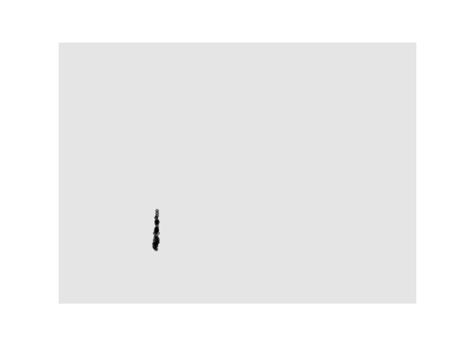
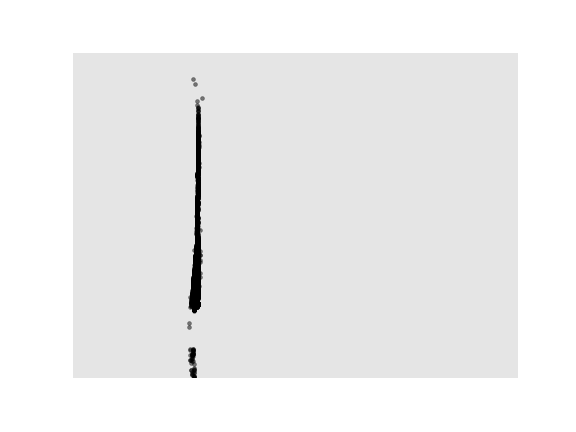
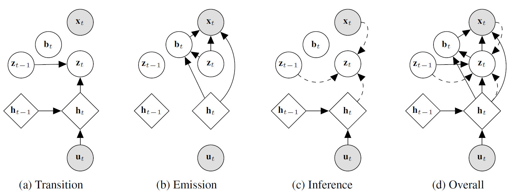

# Recurrent Flow Networks: Full Repository Coming Soon! (Minimal model code available)

This repository is the official implementation of the RFN, from *Recurrent Flow Networks: A Latent Variable Model for Spatio-Temporal Density Modelling*.

Full paper is available [here](https://arxiv.org/abs/2006.05256)

<table>
  <tr>
    <td>Real Data</td>
     <td>Samples from model</td>
  </tr>
  <tr>
    <td></td>
   <td></td>
  </tr>
 </table>

</td>
